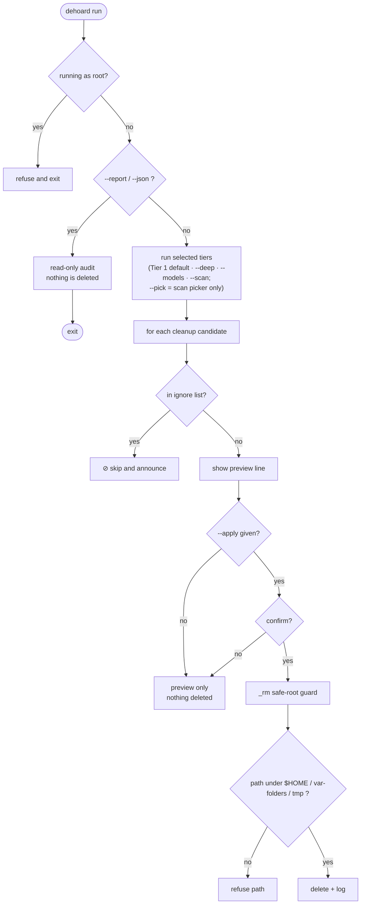
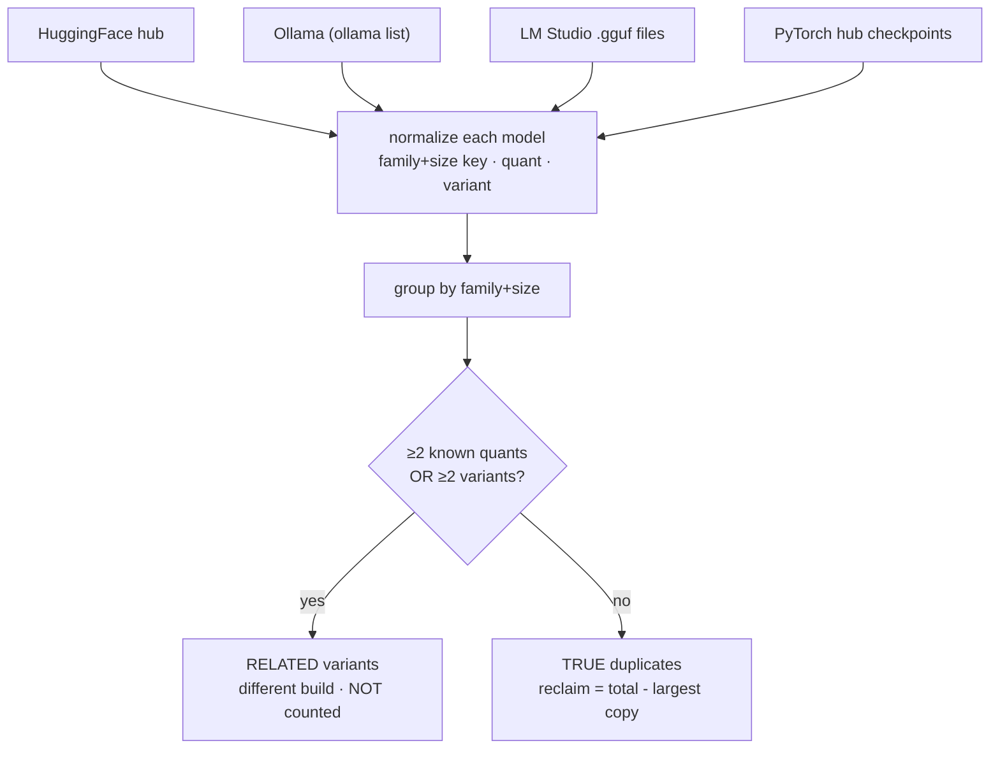

# dehoard

A disk-space cleaner for macOS, aimed at developers and ML engineers. It removes the regenerable
junk that piles up in dev and ML toolchains (caches, virtual environments, build artifacts, Docker
disk images, editor leftovers) and leaves your real data alone. It also finds the same model
downloaded into more than one tool (Ollama, LM Studio, HuggingFace), which is often the biggest
single thing eating space on a machine that runs models locally.

dehoard is one zsh script you can read top to bottom before trusting it. It previews by default: a
plain run prints what it would delete and removes nothing until you pass `--apply`.

The part general cleaners don't do: it detects the same LLM sitting in HuggingFace, Ollama, and LM
Studio at once and tells you which copies are redundant.

---

## Safety contract

dehoard runs `rm`, so here is what it guarantees before you run anything.

- Preview by default. A plain run deletes nothing; it prints what it would remove. You pass `--apply`
  to actually delete.
- `--apply` is the only thing that enables deletion. No other flag deletes without it, and `--dry-run`
  forces preview even when `--apply` is also present.
- It refuses to run as root, so it can't touch system-owned files.
- The delete primitive only removes paths under `$HOME`, `/var/folders`, or `/tmp`. Anything outside
  those roots is refused, even if `$TMPDIR` is mis-set, and bare `/` and `$HOME` themselves are always
  refused.
- Deletion is a real `rm`, not a move to the Trash, so it is irreversible. That is why preview comes
  first: run it, read it, then `--apply`.
- It never touches your data. Model weights, model outputs, chat and session history, source code, git
  history, and configs are detected and kept. Only regenerable caches and artifacts get removed.
- Every path dehoard removes through `_rm` is logged to `~/.cache/dehoard/run-<timestamp>.log` when
  you `--apply`.
- Provided "as is", without warranty ([MIT](LICENSE)). The safeguards are real, but you run it on your
  own machine and you are responsible for what you delete. Preview first.

The guard diagram and the test suite behind these claims are in [docs/SAFETY.md](docs/SAFETY.md).

---

## How a run works

This traces one run: the root check, the read-only branch, and the gates every deletion candidate
passes through before anything is removed.



Nearly every candidate goes through the same gates: the ignore list, the preview/apply gate, an
optional confirmation, and the safe-root guard inside the delete primitive (`_rm`). A few audited
deletions run outside `_rm`, all still `--apply`-gated: `--deep`'s root-owned system-cache sweep
(`sudo rm`), `--models`' `ollama rm`, and `--uninstall`/`--purge` removing dehoard's own footprint;
see [docs/SAFETY.md](docs/SAFETY.md).
The read-only modes (`--report`, `--json`) branch off early and never reach a delete.

`--scan --pick` adds an interactive selection layer on top of these gates rather than replacing them:
it opens one `fzf` picker per category (biggest first; interactive-only, so it skips the Tier 1
sweep), and for each category reprints what you marked and asks once. It still needs `--apply`, an
empty selection or Esc skips that category (deletes nothing), and every path dehoard removes directly
still passes the safe-root guard; environment managers (conda/uv/Android/Rust) use their own uninstaller.

---

## Quickstart

Preview before you apply.

```sh
./dehoard.sh --report                          # fast map: biggest dirs, reclaimable caches, duplicate models (start here)
./dehoard.sh --deep --models --scan --dry-run  # exhaustive preview: every item that would be deleted, deletes nothing
./dehoard.sh --apply                            # reclaim the always-safe Tier 1
./dehoard.sh --scan --pick --apply              # pick interactively which project artifacts to delete
```

Flags combine in any order, and without `--apply` (or with `--dry-run`) any combination only previews.
`--report` is its own read-only mode: it prints the map and exits, so it does not stack with the
action-flag preview; run both to see everything (the report for the duplicate-model finder, the
dry-run combo for the exact per-item delete list). The `--pick` picker covers `--scan` project
artifacts only: Tier 1 is a safe batch, and model weights are removed solely through `--models`, so
neither appears in the picker.

## Install

```sh
# one file; read it before you run it
curl -fsSL https://raw.githubusercontent.com/vishwaksena-dingari/dehoard/main/dehoard.sh -o dehoard.sh
chmod +x dehoard.sh

# or clone
git clone https://github.com/vishwaksena-dingari/dehoard && cd dehoard
```

Requires macOS and zsh (the default shell since Catalina).

## Usage

| Command | What it does |
|---|---|
| `dehoard --report` | Read-only audit: biggest dirs, reclaimable caches, model inventory, cross-tool duplicates. Deletes nothing. |
| `dehoard` | Preview the always-safe (Tier 1) cleanup. Deletes nothing. |
| `dehoard --apply` | Reclaim the Tier 1 safe stuff. |
| `dehoard --deep` | Add Tier 2: aggressive caches (Library caches, Xcode DerivedData, Docker prune, git gc). Pair with `--apply`. Like Tier 1 it runs as a batch with no per-item prompt (just the preview/apply gate), so preview it first. |
| `dehoard --models` | Interactive cleanup of LLM/ML weights (HuggingFace, PyTorch, Ollama, LM Studio, NLTK). |
| `dehoard --scan` | Interactive scan of project artifacts (venvs, `node_modules`, build dirs, editor leftovers, orphaned tools). |
| `dehoard --scan --pick --apply` | Same scan, but instead of prompting per item it opens **one `fzf` picker per category, biggest first** (a per-category summary of counts + sizes prints first as a contents page). In each category: TAB to mark, **Ctrl-A** all, **Ctrl-D** none, Enter to confirm, **Esc skips that category**; the preview shows last-modified, the recreate command, and any caveat. Interactive-only (skips the Tier 1 sweep); needs `fzf` and `--apply`; falls back to per-item prompts without `fzf`. |
| `dehoard --json` | Machine-readable model inventory and duplicates as pure JSON on stdout. |
| `dehoard --dry-run` | Force preview even with `--apply` (the safe default, made explicit). |
| `dehoard --yes` / `-y` | Auto-confirm prompts. Combine with `--apply`; use with care. |
| `dehoard --list-ignored` / `--unignore <path>` / `--reset-ignore` | Manage the always-skip ignore list. |
| `dehoard --uninstall` | Remove dehoard: the deletion logs (`~/.cache/dehoard`) and the script. Keeps your ignore list. Preview-first; `--dry-run` to see the plan, `--yes` to skip the prompt. |
| `dehoard --purge` | Like `--uninstall`, but also removes your ignore list (`~/.config/dehoard`), printing it first. |
| `dehoard --help` | Full breakdown of every action and why it's safe. |
| `dehoard --version` / `-V` | Print the version and exit. |

Flags combine in any order. A sensible order is `--report`, then a preview, then `--apply`. Tier
behavior is in [docs/ARCHITECTURE.md](docs/ARCHITECTURE.md); the full per-item list is in
[docs/CLEANS.md](docs/CLEANS.md).

---

## Cross-tool duplicate-model detection

The same model often sits in several tools under different names. `dehoard --report` finds those and
separates true duplicates (the same build, where keeping one copy is safe) from related variants (a
different quant or base/instruct, which are not interchangeable):

```text
$ dehoard --report

━━ True cross-tool duplicate models (same build in 2+ tools) ━━
   Same family, size, quant & variant, safe to keep one.
  ● llama-8b        2 copies, ~16.0G total (keep 1 → reclaim ~8.0G)
       HF             8.0G  Meta-Llama-3-8B-Instruct-Q8
       Ollama         8.0G  llama3:8b-instruct-q8
  ────────
  ⭐ Potential reclaim from cross-tool duplicates: ~8.0G

── Related cross-tool variants (same model, DIFFERENT build, NOT counted) ──
   Same family+size but a differing quant (Q4≠Q8) or variant (base≠instruct).
  ● mistral-7b      2 builds, ~13.0G total, DIFFERENT builds, not redundant
       LMStudio       6.0G  Mistral-7B-Instruct-Q4   [q4/instruct]
       HF             7.0G  Mistral-7B               [?/base]
```

This shows how each model gets sorted into one bucket or the other.



Duplicate detection is report-only. Matching is by normalized name, so a `Q4` is never treated as a
`Q8`, and weights are never deleted automatically. You remove a redundant copy yourself with
`--models` after checking it. The normalization rules and where each tool stores models are in
[docs/MODELS.md](docs/MODELS.md).

## `--json` for scripting

`dehoard --json` prints a JSON inventory of the cross-tool models it tracks (HuggingFace, Ollama,
LM Studio, PyTorch hub) plus the duplicate analysis. (Framework caches like Keras or Whisper appear
as a size footprint in `--report`, not as individual `models[]` entries.) It's read-only, deletes
nothing, and writes only JSON to stdout (progress text is suppressed), so it pipes into `jq`:

```sh
dehoard --json | jq '.total_reclaim_bytes'              # reclaimable bytes from true duplicates
dehoard --json | jq '.cross_tool_duplicates[].family'  # which models are duplicated across tools
dehoard --json | jq '.models[] | select(.quant=="q4")' # every Q4 model on the machine
```

The schema is stable; `schema_version` only changes on a breaking change. It's documented in
[docs/MODELS.md](docs/MODELS.md#json-schema).

## What it cleans

A short map. The full per-item list, with the reason each item is safe to remove, is in
[docs/CLEANS.md](docs/CLEANS.md) and `dehoard --help`.

- AI/ML tooling: regenerable temp and cache for ComfyUI, Automatic1111, AI CLIs, and MATLAB (logs,
  crash dumps, and caches; the installed runtime, prefs, history, and code are kept). Models,
  outputs, and chat/session history are kept. Also flags orphaned data from uninstalled dev/ML tools.
- ML model caches: HuggingFace hub, PyTorch hub, Ollama, LM Studio, and NLTK, cleaned through
  `--models`. Keras, Whisper, llama.cpp, and GPT4All caches also show up in `--report`.
- Python: venvs (found by `pyvenv.cfg`, any folder name), conda and uv, `__pycache__`,
  `.pytest_cache`, `.mypy_cache`, `*.egg-info`, and the pip cache.
- JS and other languages: `node_modules`, npm/pnpm/yarn caches, Rust `target/` and cargo, Go modules,
  Gradle, Maven, NuGet, CPAN.
- Containers: Docker `system prune`, build cache, and disk-image (`Docker.raw`) reporting.
- Apple/Xcode: DerivedData, iOS simulators, Library caches, Metal and Clang caches.
- Editors: VS Code-family stale extension versions (read from each editor's own `.obsolete`), plus
  Electron app caches.
- System: Trash, old DMGs, `.DS_Store`, editor swap files, large project logs.

Scope: dehoard sticks to dev and ML tooling and does not scan all of `~/Library`. General application
and preference cleanup is out of scope; that's a different job with a different trust model.

## Configuration

Set via environment variables, for example in `~/.zshrc`:

| Variable | Default | Effect |
|---|---|---|
| `DEHOARD_APPLY_DEFAULT` | `false` | `true` makes `--apply` the default (`--dry-run` still forces preview). |
| `DEHOARD_IGNORE_ENABLED` | `true` | `false` disables the ignore list entirely (no "Always skip?" prompts; the file is never written or read). |
| `CACHE_MIN_MB` | `100` | Minimum size in MB for a cache dir to appear in the generic sweep. |
| `DEHOARD_PM_TIMEOUT` | `120` | Seconds before a single external package-manager cleanup (brew/npm/yarn/trunk/…) is timed out and skipped, so one hung tool can't freeze the run. |
| `NO_COLOR` | unset | Set to any value to disable terminal color ([no-color.org](https://no-color.org)). Color is also off when stdout isn't a TTY (e.g. piped), and never appears in `--json` or the deletion log. |
| `CLICOLOR_FORCE` | unset | Set to `1` to force color even when stdout isn't a TTY. `--json` stays pure JSON regardless. |

The ignore list lets you mark a path "always skip" at the moment you decline a prompt. It's a
plain-text file you can edit by hand. Its lifecycle, and the `--list-ignored` / `--unignore` /
`--reset-ignore` flags, are in [docs/SAFETY.md](docs/SAFETY.md#ignore-list).

## Footprint and uninstall

dehoard's entire on-disk footprint is three locations:

- `~/.local/bin/dehoard`, the script itself (placed there by `install.sh`).
- `~/.cache/dehoard/`, created on `--apply`: one `run-<timestamp>.log` per run (the deletion record).
  Regenerable; pure exhaust.
- `~/.config/dehoard/ignore`, created only if you choose "Always skip" at a prompt: your hand-authored
  list of paths to never touch. This is config, so it is treated as yours.

(Honors `XDG_CACHE_HOME` / `XDG_CONFIG_HOME` if set. Read-only modes and previews write nothing.)

To remove dehoard:

```sh
dehoard --uninstall            # remove the logs + the script; KEEPS your ignore list
dehoard --purge                # also remove the ignore list (prints it first)
dehoard --uninstall --dry-run  # just show the plan
```

Following the `apt remove` vs `apt purge` convention, `--uninstall` removes the regenerable logs and
(when you ran the standard `~/.local/bin/dehoard` install) the script, but keeps your ignore list and
tells you where it is. `--purge` removes that too, echoing it first so the one irreplaceable file is
never lost silently. A copy run from somewhere else (a cloned repo, a custom path, or a symlink) is
never deleted; dehoard prints the `rm` command for it instead. The fully manual equivalent:

```sh
rm ~/.local/bin/dehoard
rm -rf ~/.cache/dehoard ~/.config/dehoard
```

## Documentation

- [docs/SAFETY.md](docs/SAFETY.md): the safety model, the `_rm` guard, the ignore list, and the test suite.
- [docs/ARCHITECTURE.md](docs/ARCHITECTURE.md): the tier model, run flow, and how to add a new cleanup scanner.
- [docs/MODELS.md](docs/MODELS.md): where local LLMs live on disk, the duplicate-detection rules, and the `--json` schema.
- [docs/CLEANS.md](docs/CLEANS.md): the full inventory of what every mode cleans.
- [docs/PHILOSOPHY.md](docs/PHILOSOPHY.md): the design stance, why trust is the only feature that matters and why the tool stays small on purpose.

## Contributing

Issues and pull requests are welcome; see [CONTRIBUTING.md](CONTRIBUTING.md). To add support for a new
tool, start with ["Anatomy of a scanner"](docs/ARCHITECTURE.md#anatomy-of-a-scanner).

## License

MIT. See [LICENSE](LICENSE).
