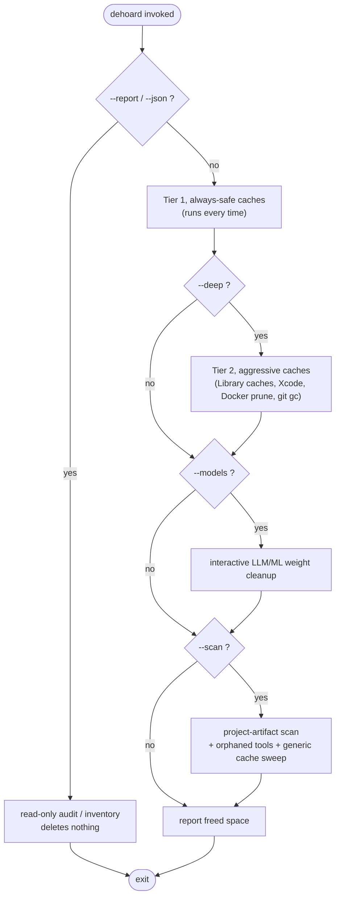
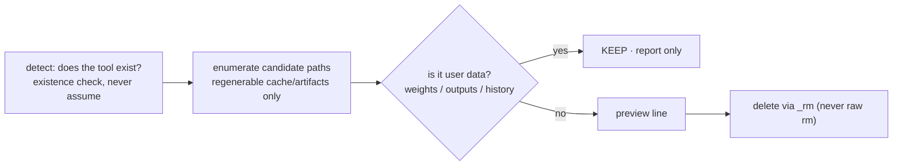

# Architecture

## One zsh script, on purpose

dehoard is a single `dehoard.sh` file. That is a deliberate choice, not laziness:

- **The install story depends on it.** `curl -fsSL …/dehoard.sh -o dehoard.sh && chmod +x` works
  because there is exactly one file to fetch and audit. A reviewer can read the whole tool top to
  bottom before running it, important for something that deletes files.
- **No runtime dependencies.** Pure zsh plus the standard macOS userland. No package to install, no
  interpreter version to match, nothing to `pip`/`npm` first.
- **Distribution and organization are separate concerns.** "One file to ship" does not mean "one
  undifferentiated blob", the executable logic is organized into named functions with a `main()`
  dispatch (below).

## Code structure: `main()` dispatch

The top of the file is configuration, flag parsing, the safety setup, and the shared helpers
(`_ask`, `_rm`). Each run-mode is then a named function, and `main()` is the entire control flow in
a few lines, you can understand what the program does before reading a single line of deletion code:

```zsh
main() {
  run_report      # read-only; exits the script if --report/--json
  clean_tier1     # always-safe caches
  clean_deep      # Tier 2 (self-guards on $DEEP)
  clean_models    # self-guards on $MODELS
  run_scan        # self-guards on $SCAN
  print_result
}
main "$@"
```

(That block is the actual dispatch from `dehoard.sh`, verbatim.)

Each cleanup function self-guards on its flag, so the dispatch reads top-to-bottom in execution
order. The ~470-line `--help` text lives in a single `usage()` heredoc rather than hundreds of
`echo` statements, so it never buries the logic. Every deletion still routes through the one `_rm`
primitive (below), the function split changes organization, never the deletion contract.

## The tier model

dehoard's behavior is organized into tiers and modes. Tier 1 always runs; everything else is opt-in
via a flag. The read-only modes (`--report`, `--json`) are a separate branch that never deletes.



- **Tier 1 (always):** regenerable caches with zero consequences (browser update clones, package
  manager caches, temp files, Trash). Safe to run anytime.
- **Tier 2 (`--deep`):** caches with a real but minor cost (a rebuild, a re-download). Library
  caches, Xcode DerivedData, Docker prune, large-repo `git gc`, etc.
- **`--models`:** interactive removal of LLM/ML weights. Always per-item; weights are user data, so
  nothing here is ever batch-deleted.
- **`--scan`:** crawls your project tree for regenerable artifacts (venvs, `node_modules`, build
  dirs), detects orphaned dev/ML tool data, and size-ranks remaining caches.

The exact items in each tier are inventoried in [CLEANS.md](CLEANS.md), and the canonical source is
`dehoard --help`, which explains every item and why it's safe.

## How a deletion flows

Whatever requests a delete, it always passes the same gates: the **ignore list** check, the
**preview→apply** gate, an optional **confirmation** (interactive modes), and the central **`_rm`
safe-root guard**. That guard and the full run flow are diagrammed in
[SAFETY.md](SAFETY.md#the-_rm-safe-root-guard) and the [main README](../README.md#how-a-run-works).
Routing every deletion through one guarded primitive is what lets dozens of independent cleanup
rules stay safe without each re-implementing the safety checks.

## Design principles

- **Preview-by-default.** Safe is the default; deletion is opt-in. (See [SAFETY.md](SAFETY.md).)
- **Generic structural rules over hardcoded lists.** Where a pattern exists, dehoard matches on it
  instead of enumerating names, e.g. Python environments are detected by the presence of
  `pyvenv.cfg` (any folder name), and Electron app caches are matched by their canonical Chromium
  cache subfolder names rather than a fixed app list. This covers tools no rule names yet, and tools
  that don't exist yet.
- **Report, never auto-delete user data.** Anything that might be data a user cares about (model
  weights, the Docker disk image, orphaned tool data) is reported, not silently removed.
- **One delete primitive.** All removals go through `_rm` with its safe-root whitelist.

## Anatomy of a scanner

Adding support for a new tool means adding a *scanner*: a small block that finds regenerable paths
and offers them for deletion. The shape is consistent:



Checklist for a new scanner:

1. **Drive off existence checks.** Use `command -v <tool>` or a path test; never assume a tool is
   installed. (CI also rejects any hardcoded `/Users/<name>` path.)
2. **Only target regenerable data.** If a path holds weights, outputs, or session/chat history,
   *keep* it and at most report it, never delete it.
3. **Delete only through `_rm`.** Never call `rm` directly; `_rm` enforces the safe-root whitelist
   and the dry-run/preview behavior for free.
4. **Prefer a structural rule** (a marker file, a canonical subfolder name) over hardcoding an app
   name, so the scanner generalizes.
5. **Add a fixture test** in `test/run.zsh` proving it deletes the cache but keeps adjacent user
   data. The suite is the safety contract; a scanner isn't done until it's covered.

See [CONTRIBUTING.md](../CONTRIBUTING.md) for the contribution workflow.
