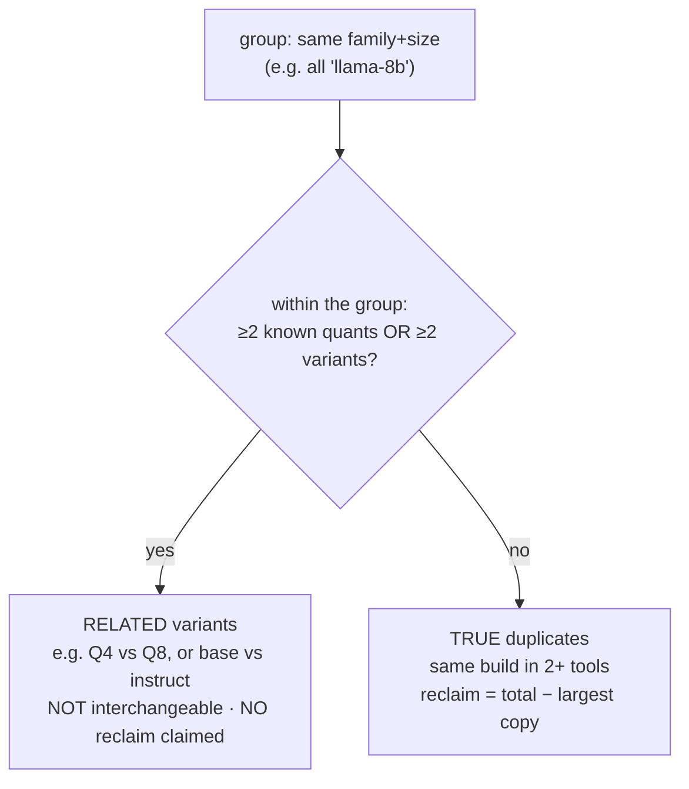

# Where local LLMs live: and how dehoard de-duplicates them

The single biggest hidden disk cost on an ML Mac is **the same model downloaded several times**.
Each local-model tool keeps its own copy in its own location under its own naming scheme, so a
machine can hold the same 8B model three or four times without the user ever realizing it. This page
maps where models hide and explains exactly how dehoard decides what is a true duplicate.

## The storage map

A *logical* model (say, Llama-3-8B-Instruct) becomes *physical* copies scattered across tools:


| Tool | Where it stores models | How dehoard enumerates it |
|---|---|---|
| HuggingFace | `~/.cache/huggingface/hub/models--<org>--<name>/` | directory listing |
| Ollama | `~/.ollama/models` (content-addressed blobs + manifests) | `ollama list` (names + sizes) |
| LM Studio | `~/.lmstudio/models/**/*.gguf` | `.gguf` file listing |
| PyTorch hub | `~/.cache/torch/hub/checkpoints/` | file listing |

Because the formats differ (safetensors vs GGUF vs content-addressed blobs), dehoard cannot dedupe
by bytes. It matches by **normalized name** instead, which is why it is careful to distinguish a
genuine duplicate from a merely *related* model.

## Normalization

Each model name is reduced to three things:

- **Family + size key**: e.g. `Meta-Llama-3-8B-Instruct-Q8` and `llama3:8b` both normalize to
  `llama-8b`. (Done by matching a known family list and extracting the parameter count.)
- **Quant**: `q4`, `q8`, `f16`, … or *unknown* (`null`) when the name carries no quant token.
- **Variant**: `instruct` (also `chat`/`-it`) or `base`.

## Classification: true duplicate vs related variant

Models that share a family+size key are grouped, then split:



- A **true duplicate** is the same build sitting in two or more tools. Keeping one is safe, so
  dehoard reports an estimated reclaim (everything except the largest single copy).
- A **related variant** shares the family and size but differs in quant or base/instruct. These are
  **not** interchangeable, so dehoard lists them for your awareness but **claims no reclaim**.
- **Conservative by design:** an *unknown* quant never *creates* a conflict, so the headline still
  fires for genuine matches, but dehoard never over-claims. And the whole feature is **report-only**:
  weights are never auto-deleted. You remove a redundant copy yourself via `--models` after
  verifying the two really are the same build.

## JSON schema

`dehoard --json` emits this inventory as pure JSON on stdout (read-only; nothing is deleted; all
human/progress text is suppressed so the output pipes cleanly into `jq`). The schema is a **stable
contract**: `schema_version` is incremented only on a breaking change, fields are added additively,
sizes are integers (`size_bytes`), and unknown values are explicit `null`.

```json
{
  "schema_version": 1,
  "generated_by": "dehoard",
  "generated_at": "2026-06-01T00:00:00Z",
  "models": [
    {
      "tool": "HF",
      "name": "meta-llama/Meta-Llama-3-8B-Instruct-Q8",
      "family": "llama-8b",
      "quant": "q8",
      "variant": "instruct",
      "size_bytes": 8589934592,
      "path": "/Users/<you>/.cache/huggingface/hub/models--meta-llama--Meta-Llama-3-8B-Instruct-Q8"
    }
  ],
  "cross_tool_duplicates": [
    {
      "family": "llama-8b",
      "copies": 2,
      "tools": ["HF", "Ollama"],
      "total_bytes": 17179869184,
      "reclaim_bytes": 8589934592,
      "entries": [ { "tool": "HF", "name": "…", "size_bytes": 8589934592, "quant": "q8", "variant": "instruct", "path": "…" } ]
    }
  ],
  "related_variants": [
    {
      "family": "mistral-7b",
      "builds": 2,
      "tools": ["HF", "LMStudio"],
      "total_bytes": 13958643712,
      "entries": [ { "tool": "LMStudio", "name": "…", "size_bytes": 6442450944, "quant": "q4", "variant": "instruct", "path": "…" } ]
    }
  ],
  "total_reclaim_bytes": 8589934592
}
```

Field notes:

- **`models[]`** is the honest physical inventory, one object per model copy actually on disk.
- **`cross_tool_duplicates[]`** are the true duplicates; `reclaim_bytes` is the safe-to-reclaim
  amount for that group (total minus the largest copy). `total_reclaim_bytes` sums them.
- **`related_variants[]`** are same-family-size groups with a real quant/variant difference, listed,
  never counted toward reclaim.
- **`quant`** is `null` when the name carries no quant token; **`path`** is `null` for Ollama
  (content-addressed storage has no single model-named path).

Example queries:

```sh
dehoard --json | jq '.total_reclaim_bytes'                       # bytes reclaimable from true dups
dehoard --json | jq '.cross_tool_duplicates[] | {family, reclaim_bytes}'
dehoard --json | jq '[.models[] | select(.tool=="Ollama")] | length'   # how many Ollama models
```
