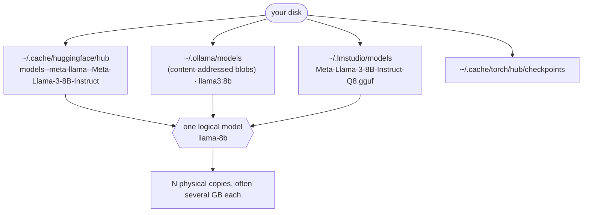

# Where local LLMs live: and how dehoard de-duplicates them

The single biggest hidden disk cost on an ML Mac is **the same model downloaded several times**.
Each local-model tool keeps its own copy in its own location under its own naming scheme, so a
machine can hold the same 8B model three or four times without the user ever realizing it. This page
maps where models hide and explains exactly how dehoard decides what is a true duplicate.

## Who this is for

- **A casual Ollama/LM Studio user** who just wants space back: run `dehoard --report` to see total
  model footprint and any cross-tool duplicates, then `dehoard --models` to clear a tool you no longer
  use. You never need to understand quant or variant tokens to benefit.
- **A developer** with a model or two from a side project: the duplicate report is a quick win, it
  tells you when the same model is sitting in two tools so you can drop one copy.
- **An ML practitioner or researcher** (the real target) with many GB spread across HuggingFace,
  Ollama, LM Studio, and PyTorch hub: this is where the cross-tool inventory earns its keep, surfacing
  duplicate GB that no single tool can see. (It is also where today's per-tool removal is bluntest, see
  the `--models` note below.)

## The storage map

A *logical* model (say, Llama-3-8B-Instruct) becomes *physical* copies scattered across tools:



| Tool | Where it stores models | How dehoard enumerates it |
|---|---|---|
| HuggingFace | `~/.cache/huggingface/hub/models--<org>--<name>/` | directory listing |
| Ollama | `~/.ollama/models` (content-addressed blobs + manifests) | `ollama list` (names + sizes) |
| LM Studio | `~/.lmstudio/models/**/*.gguf` | `.gguf` file listing |
| PyTorch hub | `~/.cache/torch/hub/checkpoints/` | file listing |

Because the formats differ (safetensors vs GGUF vs content-addressed blobs), dehoard cannot dedupe
by bytes. It matches by **normalized name** instead, so it must distinguish a genuine duplicate from
a merely *related* one.

## Normalization

Each model name is reduced to three things:

- **Family + size key**: e.g. `Meta-Llama-3-8B-Instruct-Q8` and `llama3:8b` both normalize to
  `llama-8b`. (Done by matching a known family list and extracting the parameter count.)
- **Quant**: `q4`, `q8`, `f16`, … or *unknown* (`null`) when the name carries no quant token.
- **Variant**: `instruct` (also `chat`/`-it`) or `base`.

## Classification: true duplicate vs related variant

Models that share a family+size key are grouped, then split:


- A **true duplicate** is the same build sitting in two or more tools. Keeping one is safe, so
  dehoard reports an estimated reclaim (everything except the largest single copy).
- A **related variant** shares the family and size but differs in quant or base/instruct. These are
  **not** interchangeable, so dehoard lists them for your awareness but **claims no reclaim**.
- **Conservative by design:** an *unknown* quant never *creates* a conflict, so the headline still
  fires for genuine matches, but dehoard never over-claims. And the whole feature is **report-only**:
  weights are never auto-deleted, and they are never offered in the `--scan --pick` picker either.
  You remove a redundant copy yourself via `--models` after verifying the two really are the same build.

### Cross-tool only, not within-tool

Duplicate detection is strictly **cross-tool**: a group is reported only when the same model appears in
**two or more different tools** (the code requires `≥2 copies AND ≥2 tools`). Two copies of the same
model *inside a single tool* are **not** flagged. In practice this almost never happens, Ollama is
content-addressed (identical blobs are stored once, so it cannot hold a true byte-duplicate of itself),
and the others key models by name. So "is `llama3:8b` duplicated *within* Ollama?" is a question dehoard
deliberately does not try to answer; "is `llama3:8b` *also* in LM Studio or HuggingFace?" is exactly
what it answers.

## Actually removing a copy: the `--models` flow

The report tells you *what* is redundant; `dehoard --models` is how you remove it. Be aware of its
current granularity: it is **per tool, not per model**. For each tool it lists the models with sizes,
then asks once before clearing that tool's set, e.g. *"Delete all Ollama models? [y/N]"*, *"Clear the
entire HuggingFace cache?"*. It defaults to **No**, runs nothing without `--apply`, and skips entirely
when run non-interactively.

For the re-downloadable framework caches (HuggingFace, NLTK, PyTorch hub) a whole-cache wipe is the
right unit, they regenerate on next use. For your curated model libraries (Ollama, LM Studio) it is
blunter than ideal: there is no built-in way to remove a *single* redundant copy the report identified,
short of the tool's own command (`ollama rm <name>`) or deleting the `.gguf` yourself. Finer-grained,
report-driven removal is on the roadmap (see [ARCHITECTURE.md](ARCHITECTURE.md)); until then, the report
is the map and the tool's own delete is the surgical instrument.

## JSON schema

`dehoard --json` emits this inventory as pure JSON on stdout (read-only; nothing is deleted; all
human/progress text is suppressed so the output pipes cleanly into `jq`). The schema is a **stable
contract**: `schema_version` is incremented only on a breaking change, fields are added additively,
sizes are integers (`size_bytes`), and unknown values are explicit `null`.

```json
{
  "schema_version": 1,
  "generated_by": "dehoard",
  "generated_at": "2026-06-01T00:00:00Z",
  "models": [
    {
      "tool": "HF",
      "name": "meta-llama/Meta-Llama-3-8B-Instruct-Q8",
      "family": "llama-8b",
      "quant": "q8",
      "variant": "instruct",
      "size_bytes": 8589934592,
      "path": "/Users/<you>/.cache/huggingface/hub/models--meta-llama--Meta-Llama-3-8B-Instruct-Q8"
    }
  ],
  "cross_tool_duplicates": [
    {
      "family": "llama-8b",
      "copies": 2,
      "tools": ["HF", "Ollama"],
      "total_bytes": 17179869184,
      "reclaim_bytes": 8589934592,
      "entries": [ { "tool": "HF", "name": "…", "size_bytes": 8589934592, "quant": "q8", "variant": "instruct", "path": "…" } ]
    }
  ],
  "related_variants": [
    {
      "family": "mistral-7b",
      "builds": 2,
      "tools": ["HF", "LMStudio"],
      "total_bytes": 13958643712,
      "entries": [ { "tool": "LMStudio", "name": "…", "size_bytes": 6442450944, "quant": "q4", "variant": "instruct", "path": "…" } ]
    }
  ],
  "total_reclaim_bytes": 8589934592
}
```

Field notes:

- **`models[]`** lists one object per model copy for the cross-tool tools dehoard parses into a
  family/quant/variant key (HuggingFace, Ollama, LM Studio, PyTorch hub). Framework caches shown in
  `--report`'s size footprint (Keras, Whisper, llama.cpp, GPT4All) are not enumerated here.
- **`cross_tool_duplicates[]`** are the true duplicates; `reclaim_bytes` is the safe-to-reclaim
  amount for that group (total minus the largest copy). `total_reclaim_bytes` sums them.
- **`related_variants[]`** are same-family-size groups with a real quant/variant difference, listed,
  never counted toward reclaim.
- **`quant`** is `null` when the name carries no quant token; **`path`** is `null` for Ollama
  (content-addressed storage has no single model-named path).

Example queries:

```sh
dehoard --json | jq '.total_reclaim_bytes'                       # bytes reclaimable from true dups
dehoard --json | jq '.cross_tool_duplicates[] | {family, reclaim_bytes}'
dehoard --json | jq '[.models[] | select(.tool=="Ollama")] | length'   # how many Ollama models
```
