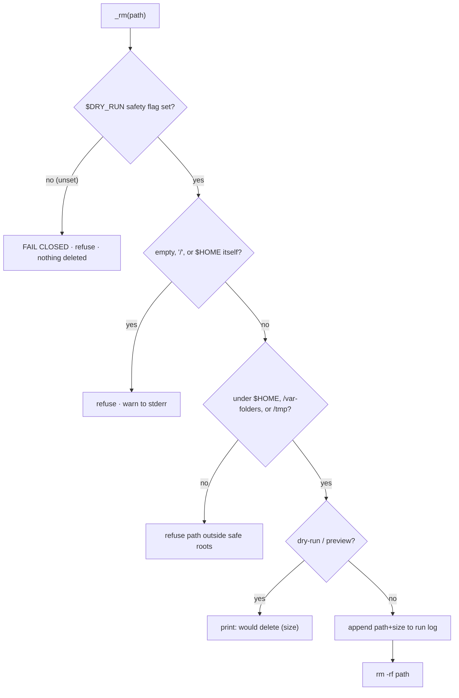
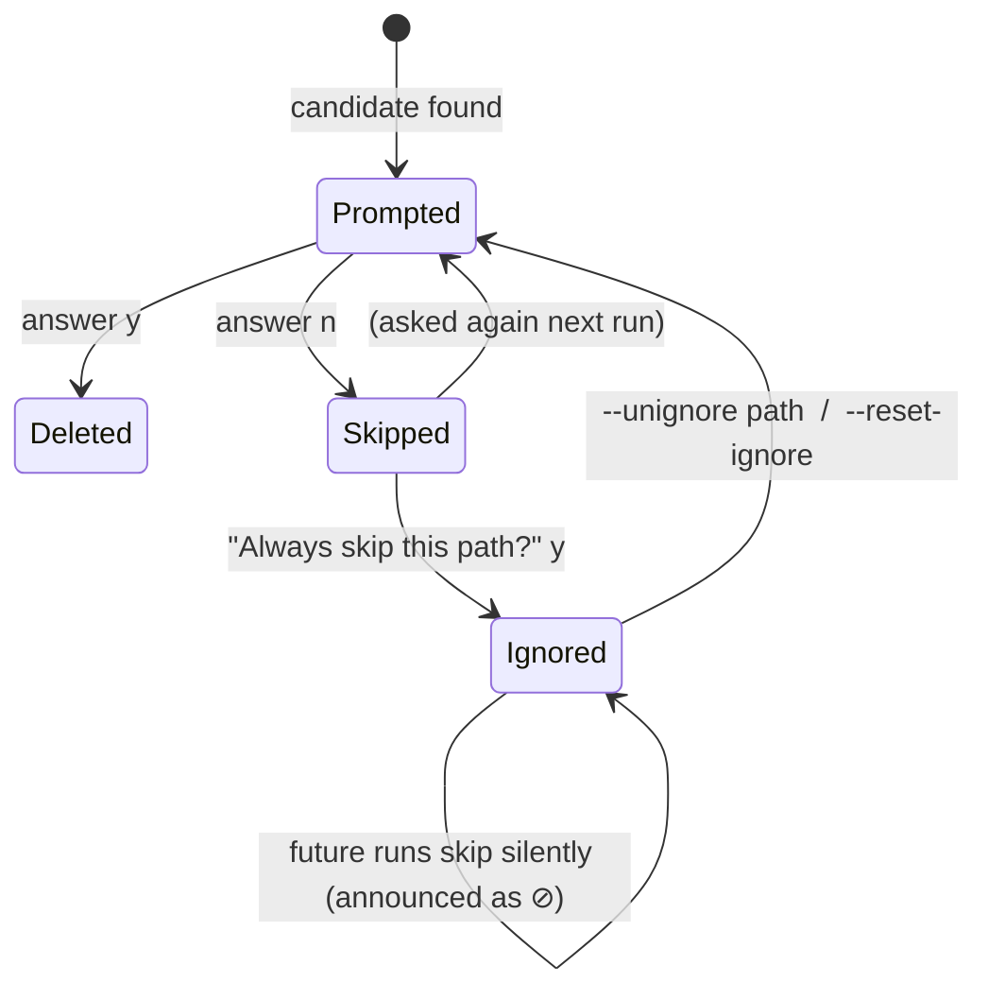

# Safety model

dehoard runs `rm`. This page documents the guarantees that make it safe to point at your machine,
the single guard that enforces them, and the test suite that proves they hold.

## The deletion contract

1. **Preview by default.** A bare run, and every `--report` / `--json` run, deletes nothing. The
   only thing that enables deletion is the explicit `--apply` flag.
2. **`--dry-run` always wins.** If both `--apply` and `--dry-run` are present (or
   `DEHOARD_APPLY_DEFAULT=true` is set), preview wins, you can always force a safe run.
3. **Refuses to run as root.** Running under `sudo` exits immediately. dehoard can therefore never
   modify system-owned files; it operates only within your user account.
4. **Deletion is irreversible.** Removal is a real `rm -rf`, not a move to the Trash. There is no
   undo. This is *why* preview-first is the default, read the preview, then apply.
5. **Your data is never a target.** Model weights, generated outputs, chat/session history, source
   code, git history, and configuration are detected and kept. Only regenerable caches, build
   artifacts, and downloadable assets are eligible for deletion.
6. **Everything removed is logged.** Under `--apply`, each deleted path and its size is appended to
   `~/.cache/dehoard/run-<timestamp>.log`.

### Questions people ask before running a file-deleter

- **Can it delete anything outside my home directory?** No. The delete primitive refuses any path
  not under `$HOME`, `/var/folders`, or `/tmp` (and their `/private/...` symlink aliases), see the
  guard below.
- **Is a deletion recoverable?** No, it's `rm`, not Trash. Preview first; that's the recovery
  mechanism.
- **Could "duplicate detection" delete a model weight I still need?** No. Duplicate detection is
  **report-only**. It never deletes weights; you remove a redundant copy yourself via `--models`
  after verifying.
- **Does it ever delete without asking?** Within `--apply`, the **cache tiers are batch-cleaned with
  no per-item prompt**, both **Tier 1** (always-safe caches) and **Tier 2** (`--deep`, more
  aggressive caches). They touch only regenerable data, so the gate is the global preview→`--apply`
  gate, not a question per file. (This is exactly why `--deep`'s "real cost after deletion" caveat
  matters: there is no per-item confirmation, so preview it first.) The **interactive modes**
  (`--models`, `--scan`) are different, they prompt **per item**. In all cases nothing deletes
  without `--apply`, and any path on your ignore list is skipped and announced.

## The `_rm` safe-root guard

Every deletion in dehoard goes through one function, `_rm`. It is the single chokepoint that makes
the whitelist impossible to bypass from any individual cleanup rule:

**Fail-closed precondition.** The very first thing `_rm` checks is that its safety state (`$DRY_RUN`)
is set. If it is somehow unset or empty, the failure a refactoring bug could introduce by
accidentally scoping a global to a function, `_rm` **refuses and deletes nothing** rather than
risk treating "unset" as "not a preview." Safe by default, even against its own future bugs. (A test
asserts this: with `$DRY_RUN` unset, `_rm` refuses even a path that is otherwise inside the safe
roots.)

Why a central guard matters: dehoard has dozens of cleanup rules across many tools. If each one
called `rm` directly, a single bad glob or a mis-computed temp path (for example, `$TMPDIR` being
unset) could escape. Routing **all** deletions through `_rm` means the safe-root whitelist is
enforced once, consistently, no matter which rule requested the delete.

## Ignore list

When you decline a deletion prompt under `--apply`, dehoard offers to remember that choice:

- The ignore file (`~/.cache/dehoard/ignore`) is plain text, one absolute path per line, and you can
  edit it directly.
- It is **opt-in**: it only ever exists if you explicitly answer "Always skip?". Nothing is written
  during `--report`, `--dry-run`, or a bare preview.
- Every skip is **announced** (`⊘ always-skip`), nothing is silently bypassed, and if the list has
  any entries, dehoard says so at startup.
- Manage it with `--list-ignored`, `--unignore <path>`, `--reset-ignore`, or by editing the file.
- Set `DEHOARD_IGNORE_ENABLED=false` to disable the feature entirely (no prompts, file never
  read/written).

## The test contract

The guarantees above are not promises in prose, they're enforced by a fixture-based test suite
(`test/run.zsh`) that runs in CI on macOS. It points dehoard at a throwaway `$HOME` and asserts,
among other things, that:

- a bare run (no `--apply`) deletes nothing;
- `--apply` clears a regenerable cache while model weights, session data, and `$HOME` itself survive;
- `_rm` refuses a path outside the safe roots, and an unset `$TMPDIR` cannot cause an out-of-root delete;
- the destructive external commands (brew/npm/docker) run exactly their documented arguments under
  `--apply`, while a dry-run runs **zero** of them;
- duplicate detection never miscounts a `Q4≠Q8` or `base≠instruct` variant as a true duplicate;
- read-only modes (`--report`, `--json`) never write the ignore file and never delete anything.

If a change breaks any of these, CI fails. That suite is the real safety contract; this page is its
human-readable summary.
